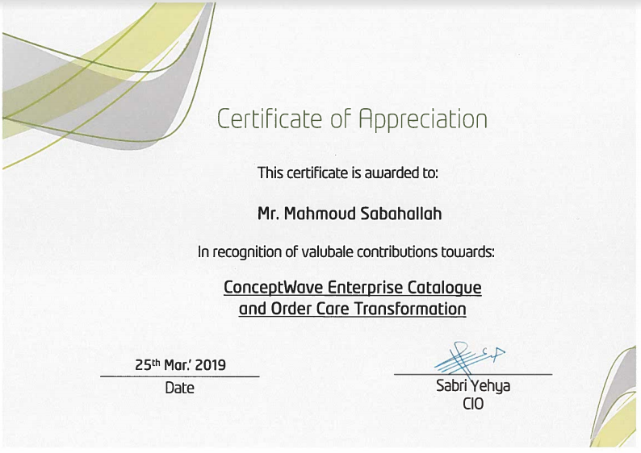
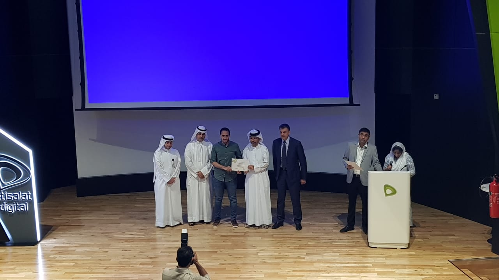

# [Mahmoud SabahAllah](https://github.com/sabahallah) Certifications & Online Training Records

> This repo lists all of my certifications, online trainings and awards throughout my professional career journey.

## Index

* [Online Training](#online-training)
* [Awards and Recognitions](#awards-and-recognitions)

## Online Training

| Course      | Domain | Sub Domain | Status | Certification |
| ----------- | --- | --- | ----------- | -------- |
| [Udemy:  TOGAF 9.2 Foundation](https://www.udemy.com/togaf-part1)      | Architecture | | Completed       | [View](https://www.udemy.com/certificate/UC-4VKPEAPP/)
| [Udemy:  TOGAF 9.2 Part 2 Certified Enterprise Architect](https://www.udemy.com/course/togaf-part2)      | Architecture | | Completed       | [View](https://www.udemy.com/certificate/UC-MDRSCSHI/)
| [Udemy:  Web Design for Web Developers](https://www.udemy.com/web-design-secrets/)      | Frontend | Design | Completed       | [View](https://www.udemy.com/certificate/UC-XK378KM2/)
| [Udemy: Build Responsive Real World Websites with HTML5 and CSS3](https://www.udemy.com/design-and-develop-a-killer-website-with-html5-and-css3/)   | Frontend | CSS | Completed        | [View](https://www.udemy.com/certificate/UC-NB50CQWJ/)
| [Udemy: Advanced CSS and Sass: Flexbox, Grid, Animations and More](https://www.udemy.com/design-and-develop-a-killer-website-with-html5-and-css3/)   | Frontend |  CSS | Completed        | [View](https://www.udemy.com/certificate/UC-IAI350O4/)
| [Udemy: The Complete JavaScript Course 2019](https://www.udemy.com/the-complete-javascript-course/)   | Frontend |  Javascript | Completed        | [View](https://www.udemy.com/certificate/UC-7HD9YZ33/)
| [Udemy: JavaScript: Understanding the Weird Parts](https://www.udemy.com/understand-javascript/)      | Frontend |  Javascript | Completed       | [View](https://www.udemy.com/certificate/UC-1ERCIUNO/)
| [Udemy: Spring Framework And Dependency Injection](https://www.udemy.com/spring-framework-video-tutorial/)      | Backend | Spring| Completed       | [View](https://www.udemy.com/certificate/UC-K8QP42CS/)
| [Udemy: Spring Framework Master Class](https://www.udemy.com/spring-tutorial-for-beginners/)   | Backend | Spring| Completed        | [View](https://www.udemy.com/certificate/UC-YA41DL6N/)
| [Udemy: Spring Framework Tutorial: Practical, Rapid, Intuitive](https://www.udemy.com/spring-framework-4/)   | Backend | Spring| Completed        | [View](https://www.udemy.com/certificate/UC-LDDX2GL8/)
| [Udemy: Microservices with Spring Cloud](https://www.udemy.com/course/microservices-with-spring-cloud/) | Backend | Microservices & Spring Cloud| Completed | [View](https://www.udemy.com/certificate/UC-ad0a59a1-d725-4cb4-a33d-55a3f596b1b8/)
| [Udemy: AWS Concepts](https://www.udemy.com/aws-concepts)      | AWS | | Completed       | [View](https://www.udemy.com/certificate/UC-EVKXZGAE/)
| [Udemy: AWS Essentials](https://www.udemy.com/course/draft/1036550/)      | AWS | | Completed       | [View](https://www.udemy.com/certificate/UC-bfa7629c-0b65-4a51-92ce-7bb7942f9805/)
| [Udacity: Networking for Web Developers](https://www.udacity.com/course/networking-for-web-developers--ud256)      | Networking | | Completed       | NA
| [Udacity: Client Server Communication](https://www.udacity.com/course/client-server-communication--ud897)      | Networking | | Completed       | NA
| [Udacity: HTTP & Web Servers](https://www.udacity.com/course/http-web-servers--ud303) | Networking | | Completed       | NA
| [Udacity: Linux Command Line Basics](https://www.udacity.com/course/linux-command-line-basics--ud595)      | Linux | | Completed       | NA
| [Udacity: Configuring Linux Web Servers](https://www.udacity.com/course/configuring-linux-web-servers--ud299)      | Linux | | Completed       | NA
| [Udacity: Version Control with Git](https://www.udacity.com/course/version-control-with-git--ud123)      | Git | | Completed       | NA
| [Udemy: Docker Essentials](https://www.udemy.com/course/docker-essentials/) | DevOps | Docker | Completed | NA
| [Pluralsight: Docker and Kubernetes: The Big Picture](https://www.pluralsight.com/courses/docker-kubernetes-big-picture) | DevOps| Docker | Completed | [View](https://app.pluralsight.com/profile/mahmoud-sabahallah)
| [Pluralsight: Getting Started with Jenkins 2](https://www.pluralsight.com/courses/jenkins-2-getting-started) | DevOps| Jenkins | Completed | [View](https://app.pluralsight.com/profile/mahmoud-sabahallah)
| [Udemy: YAML Essentials](https://www.udemy.com/course/yaml-essentials) | Other | YAML | Completed | NA

## Awards and Recognitions

* 2019 - Successful completion of Conceptwave Enterprise Catalogue and Order Care Transformation

    
    
